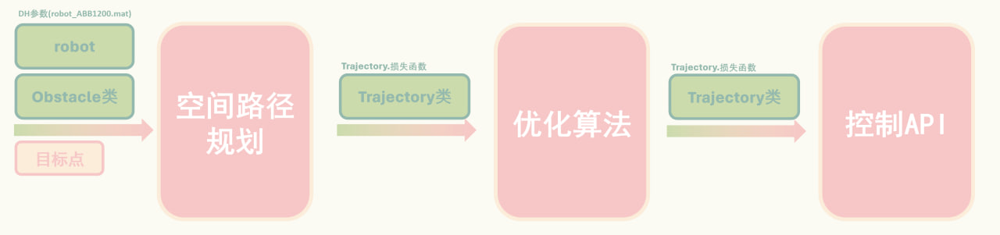

# Robotics_of_ABB1200

本md文档大部分由gpt生成

## 1. Trajectory.m

**类定义:** `Trajectory`

**属性:**
- `q`: 关节角度。
- `qd`: 关节速度。
- `qdd`: 关节加速度。
- `nT`: 末端轨迹。

**方法:**

1. **构造函数**

   - `Trajectory(q, qd, qdd, nT)`: 根据关节角度、速度、加速度和末端轨迹初始化对象。
   - **参数:**
     - `q`: 关节角度。
     - `qd`: 关节速度。
     - `qdd`: 关节加速度。
     - `nT`: 末端轨迹。

2. **plotTrajectory**
   - 作用: 绘制末端轨迹。
   - 实现: 使用 `plot3` 绘制三维空间中的轨迹。

3. **plotJointStates**
   - 作用: 绘制关节状态，包括角度、速度和加速度的变化。
   - 实现: 使用 `subplot` 和 `plot` 绘制不同关节状态的图表。

4. **calculateLosses**
   - 作用: 计算轨迹的损失，包括距离损失、平滑度损失和时间损失。
   - 参数: 
     - `obstacle`: 障碍物对象。
     - `time_per_step`: 每步时间。
     - `weights`: 损失权重。
     - `epsilon`: 防止除零错误的小数。
   - 返回值: 
     - `loss_distance`: 距离损失。
     - `loss_smoothness`: 平滑度损失。
     - `loss_time`: 时间损失。
     - `total_loss`: 总损失。

## 2. Obstacle.m

**类定义:** `Obstacle`

**属性:**
- `vertices`: 障碍物顶点。
- `edges`: 立方体的边（固定的）。

**方法:**
1. **构造函数**
   - `Obstacle(center, length, width, height)`: 根据中心点和尺寸计算立方体的顶点。
   - **参数:**
     - `center`: 中心点坐标。
     - `length`: 长度。
     - `width`: 宽度。
     - `height`: 高度。

2. **distanceToPoint**
   - 作用: 计算点到障碍物的最短距离（欧氏距离）。
   - 参数: 
     - `point`: 点的坐标。
   - 返回值: 
     - `minDist`: 最短距离。

3. **plotObstacle**
   - 作用: 绘制障碍物。
   - 实现: 使用 `plot3` 绘制障碍物的每条边。

**附加说明:** 这两个类定义了机器人轨迹的处理和障碍物的管理，分别提供了数据结构和方法来支持机器人在仿真环境中的导航和障碍物避让功能。

## 3. test.m

**类别:** 测试脚本文件  
**作用:** 用于测试机器人模型和障碍物处理的功能。

**传入参数:** 无  
**传出参数:** 无  

## 4. Model_create.m

**类别:** 脚本文件  
**作用:** 此脚本用于定义机器人模型的各个连接部分及其关节角度限制。

**主要内容:**

* 定义机器人的每个连接部分（如 ML2, ML3, ... ML7）和其对应的特性（如旋转角度、长度等）。
* 设置各个关节的角度限制（如 joint1_angle_max, joint1_angle_min 等）。
* 将定义好的连接部分和角度限制保存为 `robot_ABB1200.mat` 文件。

**传入参数:** 无  
**传出参数:** 无  
**附加说明:** 此脚本在运行时会清除所有变量并重置MATLAB的命令窗口。

## 5. robot_ABB1200.mat

**类别:** 数据文件（MAT文件）  
**作用:** 存储机器人模型的相关数据，包括各个连接部分的定义和角度限制。

**主要内容:**

* 机器人的连接部分（如 ML2, ML3 等）的定义。
* 各个关节的角度限制信息。

**附加说明:** 此文件通常由 `Model_create.m` 脚本生成，并被其他脚本用于加载机器人模型数据。 